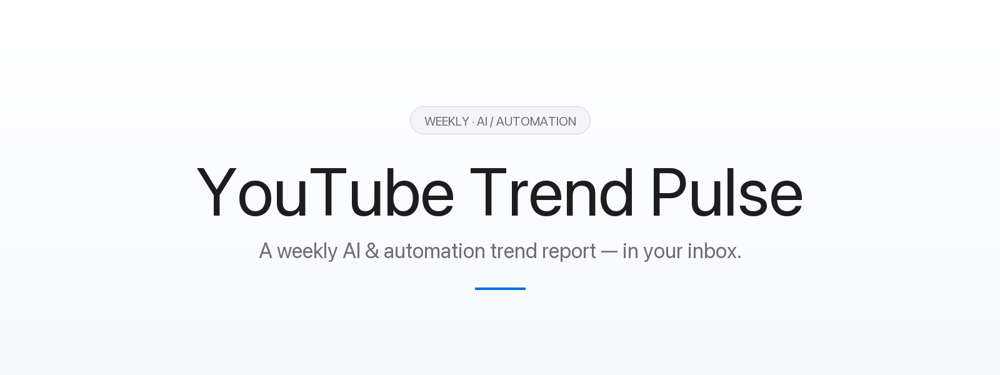
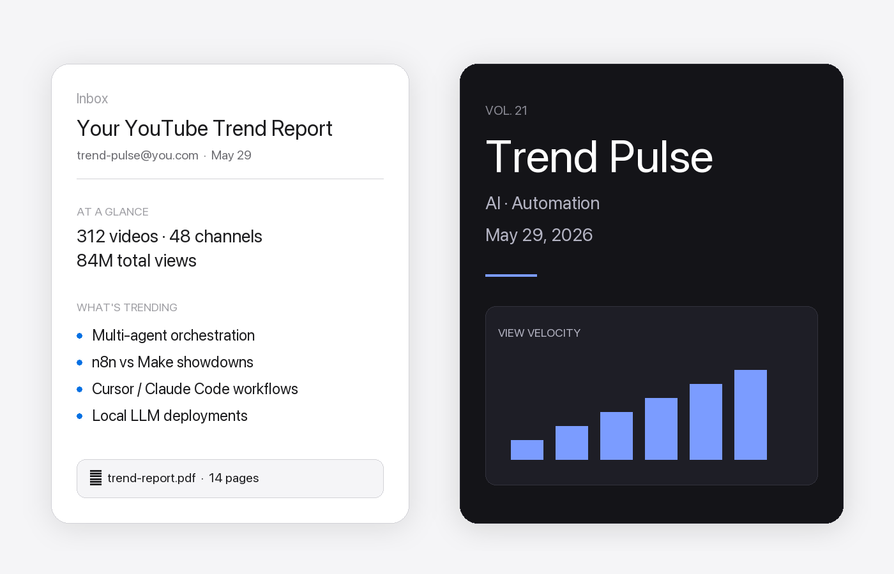
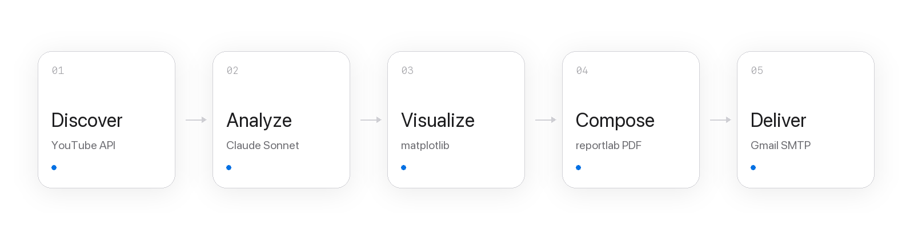
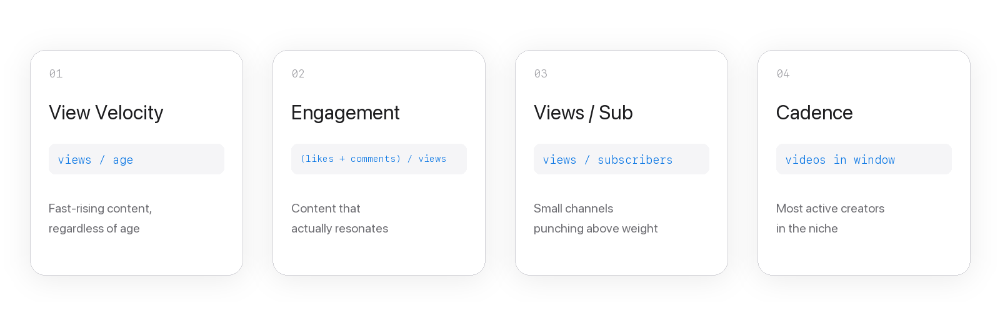
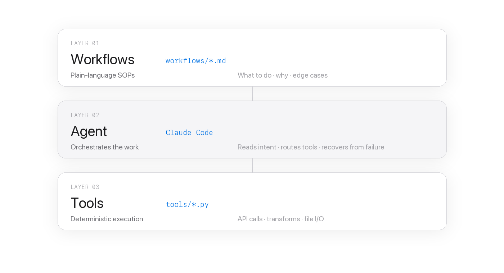

<p align="center">
  
</p>

<p align="center">
  <em>Discover what's actually trending in AI &amp; automation on YouTube — delivered weekly as a polished PDF.</em>
</p>

<br>

## What you get

<p align="center">
  
</p>

<p align="center">
  A short email with the week's signal, plus a 14-page PDF with charts, themes, and a curated watch list.
  <br>
  Generated end-to-end in about three minutes for roughly five cents.
</p>

<br>

## How it works

<p align="center">
  
</p>

<p align="center">
  Each step writes its output to <code>.tmp/</code>. If one fails, fix it and re-run just that step — the rest stays cached.
</p>

<br>

## Requirements

- Python 3.11+
- A [Google Cloud](https://console.cloud.google.com) project with **YouTube Data API v3** enabled
- An [Anthropic](https://console.anthropic.com) API key
- A Gmail account with [App Passwords](https://myaccount.google.com/apppasswords) enabled (requires 2FA)

<br>

## Setup

**1. Clone and install**

```bash
git clone https://github.com/YOUR_USERNAME/youtube-trend-pulse.git
cd youtube-trend-pulse
pip install -r requirements.txt
```

**2. Configure environment**

```bash
cp .env.example .env
```

| Variable | Where to get it |
|---|---|
| `YOUTUBE_API_KEY` | Google Cloud Console → APIs &amp; Services → Credentials |
| `ANTHROPIC_API_KEY` | Anthropic Console → API Keys |
| `GMAIL_ADDRESS` | Your Gmail address |
| `GMAIL_APP_PASSWORD` | Gmail → Security → 2-Step Verification → App Passwords |
| `REPORT_RECIPIENT` | Who gets the email (leave blank to send to yourself) |
| `NICHE_QUERIES` | Comma-separated search terms — tune to your interests |

**3. One-time Google OAuth**

The pipeline reads your YouTube subscriptions to surface content from channels you already follow.

In Google Cloud Console: **Credentials → Create Credentials → OAuth client ID → Desktop app**, then download as `credentials.json` at the project root. Then run:

```bash
python tools/setup_oauth.py
```

A browser will open. Grant read-only YouTube access. This writes `token.json`, reused on every subsequent run. Both files are gitignored.

<br>

## Running the pipeline

```bash
python tools/discover_videos.py --days 14
python tools/analyze_videos.py
python tools/generate_charts.py --style dark
python tools/build_pdf.py
python tools/send_report.py
```

Runtime ≈ 3 minutes. Cost ≈ $0.05 (one Claude call) plus free YouTube quota.

<br>

## How videos are ranked

<p align="center">
  
</p>

<p align="center">
  Claude receives the top 40 videos by velocity and synthesizes 4–6 themes with importance scores, plus 5 curated watch recommendations.
</p>

<br>

## Customization

**Change the niche** — edit `NICHE_QUERIES` in `.env`. Good additions: `"AI workflow"`, `"Cursor AI"`, `"vibe coding"`, `"local LLM"`, `"AI SaaS"`. Avoid lone broad terms like `"AI"` — too noisy.

**Change the lookback window**

```bash
python tools/discover_videos.py --days 7    # last week
python tools/discover_videos.py --days 30   # last month
```

**Skip subscription scanning** — if your subscriptions are private:

```bash
python tools/discover_videos.py --skip-subscriptions
```

**Light-mode charts**

```bash
python tools/generate_charts.py --style light
```

<br>

## Troubleshooting

**`403 quotaExceeded`** — YouTube's free tier gives 10,000 units/day. Eight search queries ≈ 800 units. Wait until midnight Pacific Time (quota reset), or reduce `NICHE_QUERIES`.

**Empty subscriptions** — YouTube hides subscriptions by default. YouTube → Settings → Privacy → uncheck "Keep all my subscriptions private".

**`SMTPAuthenticationError`** — use the 16-character App Password, not your regular Gmail password. No spaces.

**Malformed Claude response** — `analyze_videos.py` has a robust JSON extractor. If it still fails, re-run just step 2 — step 1's output is cached in `.tmp/videos_raw.json`.

**Thumbnail 404s** — missing thumbnails render as a dark placeholder. The PDF still builds.

<br>

## Architecture

<p align="center">
  
</p>

<p align="center">
  This project follows the <strong>WAT framework</strong> — plain-language workflows tell Claude what to do, deterministic Python tools do the work, and Claude orchestrates between them.
  <br>
  Keeping AI in the reasoning layer and Python in the execution layer keeps each step reliable and independently testable.
</p>

<br>

## Project structure

```
.
├── tools/
│   ├── setup_oauth.py          # One-time Google OAuth flow
│   ├── discover_videos.py      # YouTube API: search + subscription scraping
│   ├── analyze_videos.py       # Metric computation + Claude theme synthesis
│   ├── generate_charts.py      # matplotlib chart rendering
│   ├── build_pdf.py            # reportlab PDF generation
│   └── send_report.py          # Gmail SMTP delivery
├── workflows/
│   └── youtube_trend_report.md # Full SOP — edge cases, quota notes, design decisions
├── docs/                       # README visuals
├── .env.example
├── requirements.txt
└── README.md
```

<br>

## Contributing

PRs welcome. Good areas to contribute:

- Additional chart types or layout options
- Support for other niches beyond AI/automation
- A CLI wrapper to run all five steps in one command
- Scheduling support (cron / GitHub Actions)
- Alternative email providers beyond Gmail

<br>

## License

MIT
